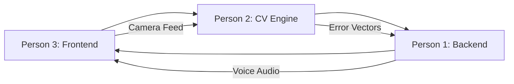

# SecondHand - Team Delegation (3 People)

## Team Overview

| Role | Focus Area | Key Deliverables |
|------|------------|------------------|
| **Person 1** | Backend Core + AI | FastAPI, Gemini, ElevenLabs, Preprocessing |
| **Person 2** | CV Engine + Algorithms | MediaPipe, Alignment, Scoring, Ghost Logic |
| **Person 3** | Frontend + UX | Next.js UI, Animations, Voice Commands |

---

# PERSON 1: Backend Core + AI Pipeline

## Ownership
- FastAPI backend server
- Gemini AI coaching integration
- ElevenLabs voice synthesis
- Video preprocessing pipeline
- API security & caching

## Deliverables

### 1. FastAPI Server Setup
```
backend/
├── app/
│   ├── main.py
│   ├── routers/
│   │   ├── coach.py      # Gemini endpoints
│   │   ├── voice.py      # ElevenLabs endpoints
│   │   └── health.py     # Health checks
│   ├── services/
│   │   ├── gemini_service.py
│   │   └── elevenlabs_service.py
│   └── config.py
├── requirements.txt
└── Dockerfile
```

### 2. Gemini Coach API
- Endpoint: `POST /api/coach/cue`
- Takes error vectors, returns coaching text
- Streaming support for fast response

### 3. ElevenLabs TTS API
- Endpoint: `POST /api/voice/synthesize`
- Caches common phrases
- Returns audio stream

### 4. Preprocessing Scripts
- Extract keypoints from expert videos
- Normalize and smooth data
- Output JSON for frontend

---

# PERSON 2: CV Engine + Alignment Algorithms

## Ownership
- MediaPipe integration
- Keypoint extraction & normalization
- Alignment algorithm (spatial + temporal)
- Scoring system
- Ghost positioning logic

## Deliverables

### 1. MediaPipe Integration
```
frontend/src/lib/mediapipe/
├── handTracker.ts
├── poseTracker.ts
├── types.ts
└── smoothing.ts
```

### 2. Alignment Engine
```
frontend/src/lib/alignment/
├── spatialAlign.ts    # Anchor + scale transform
├── temporalSync.ts    # Phase detection
├── procrustes.ts      # Best-fit alignment
└── scoring.ts         # Similarity calculation
```

### 3. Feedback Logic
```
frontend/src/lib/feedback/
├── cueMapper.ts       # Deterministic rules
├── errorAnalysis.ts   # Joint error vectors
└── driftDetector.ts   # Top-k problem joints
```

---

# PERSON 3: Frontend + User Experience

## Ownership
- Next.js application
- All UI components
- Animations & micro-interactions
- Voice command UI
- Camera/canvas rendering

## Deliverables

### 1. Next.js App Structure
```
frontend/src/
├── app/
│   ├── page.tsx           # Landing
│   ├── session/page.tsx   # Main view
│   └── layout.tsx
├── components/
│   ├── ghost/
│   ├── feedback/
│   ├── camera/
│   └── ui/
└── styles/globals.css
```

### 2. Core Components
- `GhostRenderer.tsx` - Canvas overlay
- `ScoreDisplay.tsx` - Animated score
- `CueOverlay.tsx` - Coaching text
- `VoiceCoach.tsx` - Audio feedback UI

### 3. Styling & Polish
- Dark mode glassmorphism
- Framer Motion animations
- Sound effects
- Loading states

---

## Integration Points



## Timeline

| Hour | Person 1 | Person 2 | Person 3 |
|------|----------|----------|----------|
| 0-2 | FastAPI setup | MediaPipe setup | Next.js scaffold |
| 2-4 | Gemini integration | Normalization | Camera component |
| 4-6 | ElevenLabs integration | Alignment algo | Ghost renderer |
| 6-8 | API testing | Scoring system | Score display |
| 8-10 | Caching layer | Cue mapper | Voice UI |
| 10-12 | Integration | Integration | Polish |
